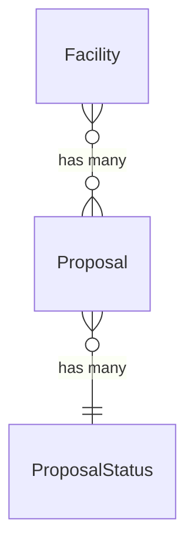
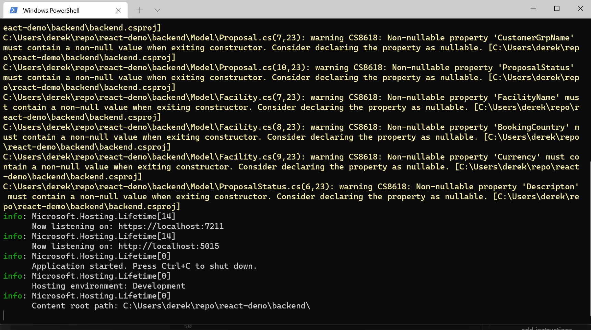
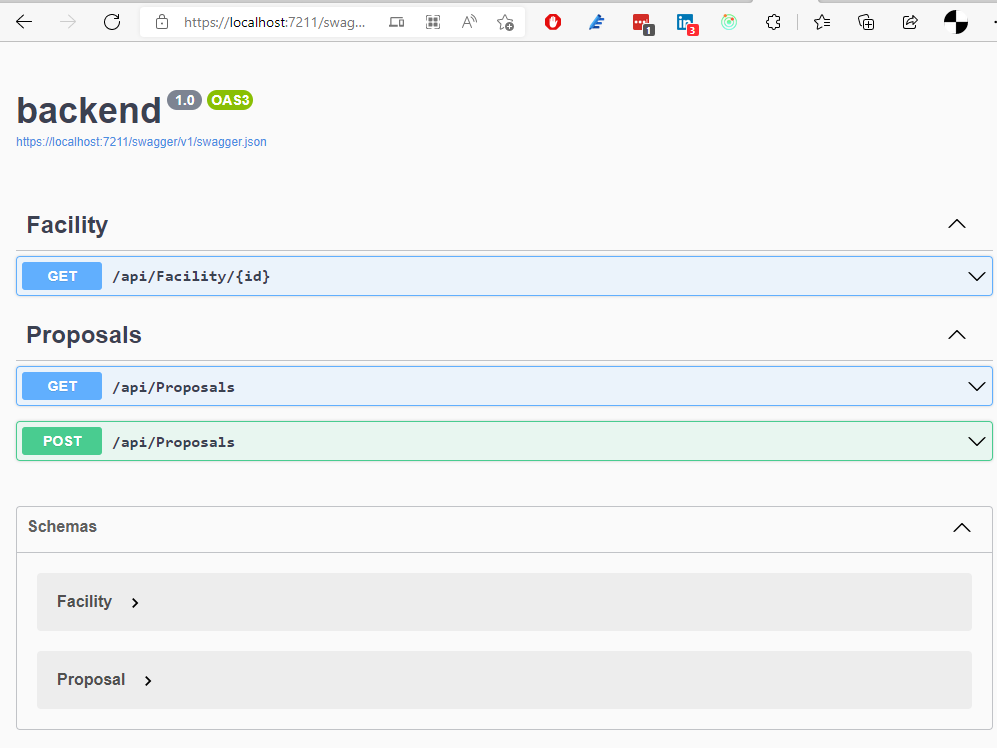

## Setup local db database

I choose to install sqllocaldb for this task - I understand that in an enterprise or cloud scenario i would have configured a non localdb database. The benefit of me using this approach is does not fill my personal computer with clutter.


Whilst preparing the data I found that line 3 column maturity date had an invalid date value in it. I changed the date 1/10/2023 since the date had gone one day beyound the month end.


The database schema can be broken down to 3 entities and 1 many to many mapping entity. (4 in total)

> Facility 

> Proposal

> ProposalStatus

> ProposalFacility (is the enity used for the many to many mapping)




 SETUP
 
 To setup database open poer shell to the folder called devops
 > cd devops
 
Run the power shell script called build.ps1.
The command requires a parameter -S which specifies the server and instance on which the database should be created. The database name will called react_sample.

**Please note** the connection to the database is the script uses the trusted connection argument. 

eg:
 > build.ps1 -S ".\sqlexpress"

The script then creates the database. 

If an error occurrs please contact support (Derek Baird 0402557550)


## Running the app

Accept the email sent with the link to the github repo.

clone the repo called react-demo

...add instructions....

In the location the repo was cloned change directory to backend
and start the application.

before running the commands below make sure the database in appsettings.json is pointing to the correct location

```cmd
cd backend
dotnet run
```



from the output of the dotnet run command check the api is running by opening the browser and going to the url specified

in this examples case it is  https://localhost:7211
add the suffix /swagger


https://localhost:7211/swagger


